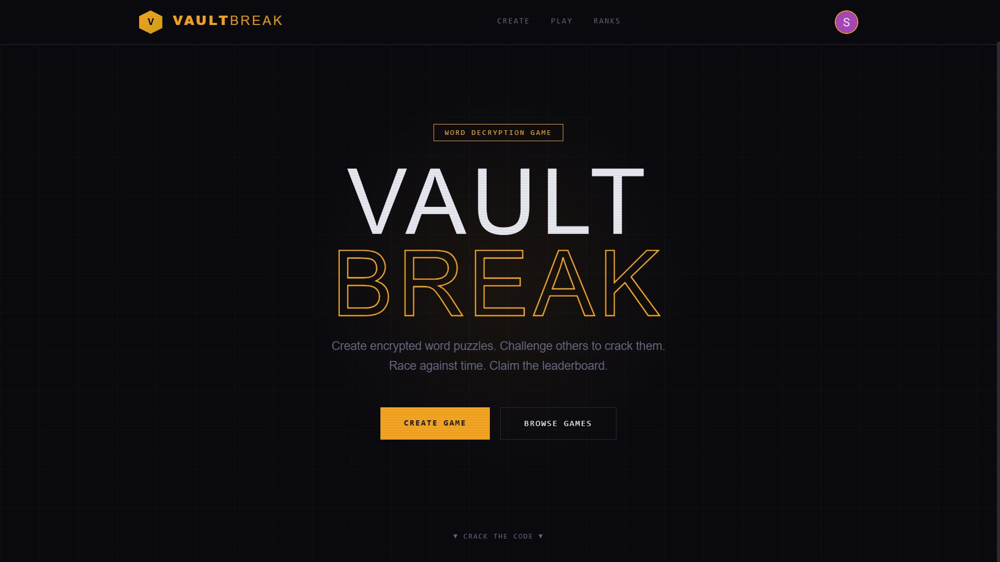

<div align="center">

# 🔐 VaultBreak





**A full-stack word decryption game. Create encrypted puzzles. Challenge others to crack them. Race against time. Claim the leaderboard.**

[](https://react.dev)
[](https://vitejs.dev)
[](https://expressjs.com)
[](https://mongodb.com)
[](https://clerk.com)
[](https://inngest.com)

</div>

---

## ✨ Features

- 🔐 **Authentication** — Google Auth, email, and username login via Clerk
- 🎮 **Create Puzzles** — Post any word with a custom hint for others to crack
- 🔤 **Play Mode** — Tap A–Z to reveal letters one by one
- ⏱️ **Pressure System** — 2-minute timer and 6 lives per round
- 🏆 **Global Leaderboard** — Score-based rankings across all players
- 🔄 **Real-time Sync** — Clerk webhooks sync users to MongoDB via Inngest

---

## 🧮 Score Formula

```
Score = 1000 (base) + (timeLeft × 5) + (livesLeft × 100)
```

> Losing a game scores **0**. Only wins count.

---

## 🛠 Tech Stack

| Layer | Technology |
|---|---|
| Frontend | React 18, Vite 5, Tailwind CSS v4 |
| Backend | Node.js, Express 4 |
| Database | MongoDB + Mongoose |
| Auth | Clerk (React SDK + Express SDK) |
| Event Sync | Inngest (Clerk webhook handler) |
| Routing | React Router v6 |
| HTTP | Axios |

---

## 📁 Project Structure

```
vaultbreak/
├── backend/
│   └── src/
│       ├── config/
│       │   └── db.js                 # MongoDB connection
│       ├── models/
│       │   ├── user.model.js
│       │   ├── game.model.js
│       │   └── score.model.js
│       ├── controllers/
│       │   ├── game.controller.js
│       │   └── score.controller.js
│       ├── routes/
│       │   ├── game.routes.js
│       │   └── score.routes.js
│       ├── middlewares/
│       │   └── auth.middleware.js    # Clerk JWT verification
│       ├── utils/
│       │   └── inngest.js            # Clerk → MongoDB user sync
│       ├── app.js
│       └── index.js
│
└── frontend/
    └── src/
        ├── pages/
        │   ├── Home.jsx
        │   ├── CreateGame.jsx
        │   ├── BrowseGames.jsx
        │   ├── PlayGame.jsx
        │   └── Leaderboard.jsx
        ├── components/
        │   └── Navbar.jsx
        ├── App.jsx
        ├── main.jsx                  # Clerk provider + theme
        └── index.css
```

---

## 🚀 Getting Started

### Prerequisites

- Node.js 18+
- A [MongoDB Atlas](https://mongodb.com/atlas) cluster
- A [Clerk](https://dashboard.clerk.com) application
- An [Inngest](https://inngest.com) account

---

### 1. Clone the repo

```bash
git clone https://github.com/your-username/vaultbreak.git
cd vaultbreak
```

---

### 2. Configure Clerk

1. Go to [dashboard.clerk.com](https://dashboard.clerk.com) and create a new application
2. Enable the following sign-in methods: **Email**, **Username**, **Google**
3. Under **Webhooks**, add a new endpoint:
   - URL: `https://your-backend-url/api/inngest`
   - Subscribe to events: `user.created`, `user.updated`, `user.deleted`
4. Copy your **Publishable Key** and **Secret Key** for the next steps

---

### 3. Backend Setup

```bash
cd backend
npm install
cp .env.example .env
```

Fill in your `.env`:

```env
MONGO_URI=mongodb+srv://<username>:<password>@cluster.mongodb.net/vaultbreak
PORT=5000
CORS_ORIGIN=http://localhost:5173
NODE_ENV=development

CLERK_SECRET_KEY=sk_test_xxxxxxxxxxxx

INNGEST_EVENT_KEY=your_inngest_event_key
INNGEST_SIGNING_KEY=your_inngest_signing_key
```

```bash
npm run dev
```

> Server runs at `http://localhost:5000`

---

### 4. Frontend Setup

```bash
cd frontend
npm install
cp .env.example .env
```

Fill in your `.env`:

```env
VITE_CLERK_PUBLISHABLE_KEY=pk_test_xxxxxxxxxxxx
VITE_API_URL=http://localhost:5000
```

```bash
npm run dev
```

> App runs at `http://localhost:5173`

---

## 📡 API Reference

| Method | Endpoint | Auth | Description |
|--------|----------|------|-------------|
| `GET` | `/api/games` | ❌ | List all games (word hidden) |
| `POST` | `/api/games` | ✅ | Create a new game |
| `GET` | `/api/games/:id` | ✅ | Get a game with word (for play) |
| `POST` | `/api/scores` | ✅ | Submit a score after a round |
| `GET` | `/api/scores/leaderboard` | ❌ | Fetch global leaderboard |
| `POST` | `/api/inngest` | — | Inngest webhook handler (Clerk sync) |

---

<!-- ## 🌐 Deployment

### Backend — [Render](https://render.com) / [Railway](https://railway.app)

1. Set all environment variables from `.env.example`
2. Set build command: `npm install`
3. Set start command: `npm start`
4. Update `CORS_ORIGIN` to your frontend URL

### Frontend — [Vercel](https://vercel.com)

1. Import the `frontend/` directory
2. Set `VITE_CLERK_PUBLISHABLE_KEY` in Vercel environment variables
3. Set `VITE_API_URL` to your deployed backend URL

> After deploying, update your Clerk webhook URL to the live backend endpoint.

---

## 📜 License

MIT © [Your Name](https://github.com/Soumyajitttt) -->